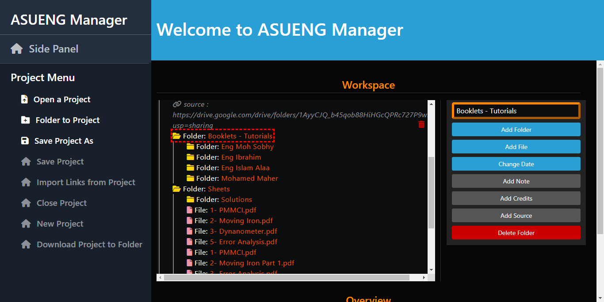
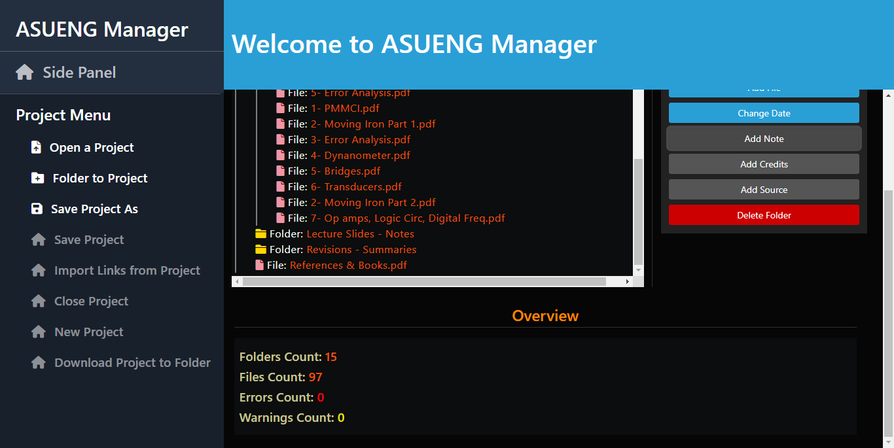

# ASUENG Library Manager

## Description

ASUENG Manager is a tool designed to facilitate the process and enable users (especially non-developers) to create and update [ASUENG Library](https://deadreyo.github.io/ASUENG-Library)'s Courses data.

It is a cross-platform desktop application, created with Electron, React & TypeScript, that offers a Graphical User Interface solution to the problem of courses' data being saved as JSON and having to be modified in its raw JSON form. This disables non-developers or non-coders from contributing by creating or modifying them, and is generally a non user-friendly way.

## Technologies

Uses Electron, React, TypeScript & Bootstrap.

## Data Shape

The courses' data consist of different types of building components:
- Folders: An organizational container that contains Files, Notes & Credits.
- Files: Representation of the real educational material such as PDF files. Under the hood they are links to the real file's link. This allows them to be used for many more cases like YouTube videos or other educational materials' links.
- Notes: These are text notes that are displayed at the top of the folder in ASUENG library, to indicate important note or information.
- Sources & Credits: The sources of the materials and credits. Displayed at the bottom of the folder.

## Features

All systems were made from scratch to be tailored to the needed use-cases & capabilities, especially the JSON Viewier.

- JSON Viewer: The main area in the workspace that parses and displays the data in a user-friendly way.
- Parsing JSON file according to the pre-defined data schema & saving work into JSON file.
- Ability to analyze a real folder from the desktop & generate a data representation for it, with support for generating notes, sources & credits from special file names.
  - Allows for quickly & automatically turning an existing folder structure on a pc into a course data.
- Ability to organize data & add folders, files, notes & sources, as well as editing & deleting.
- Ability to assign academic year to folders, files & notes for ordering data by year.
- Detection of errors or warnings for invalid user inputs or issues with data, and displaying errors beside the problematic data piece in JSON Viewier
- Displaying metadata about the data such as Folder count, files count, number of warnings & errors.
